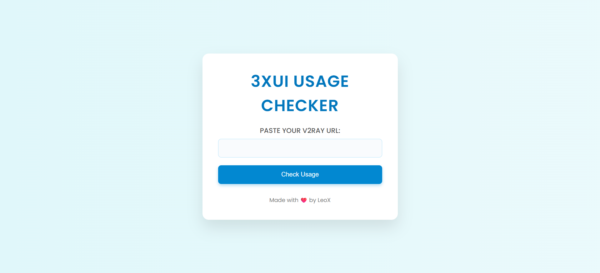
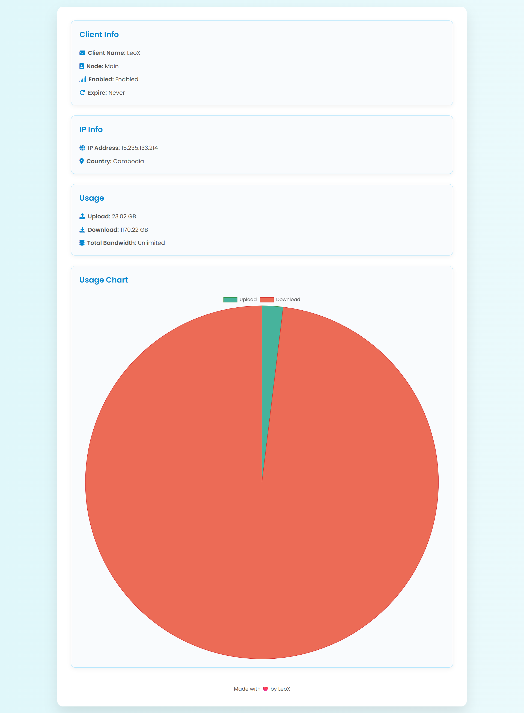

# 3xUI-Usage Checker

[](LICENSE)
[](https://github.com/xLeoX69x/3xui-usage/stargazers)

A modern customer usage portal for **x-ui / V2Ray** panel users. Check your bandwidth, quota, expiry, and more with a beautiful web UI and instant server checks.

---

## ✨ Features

* **Clean & Responsive UI** — Modern look, mobile-ready, with animated backgrounds.
* **Client Usage Stats** — Visualize upload/download/remaining quota with charts.
* **Auto Node Selection** — Paste your V2Ray/XUI URL, and the portal finds your server!
* **IP & Country Detection** — Know your own connection instantly.
* **Multiple Node Support** — Add as many servers as you want via environment variables.

---

## 🖥️ Screenshots

> 
> 

---

## 📁 Project Structure

```
3xui-usage/
├── app.py
├── templates/
│   ├── index.html
│   └── result.html
├── .env.example
└── README.md
```

---


## 🛡️ Security Note

* Never commit your real `.env` with passwords or API keys.
* Use `.env.example` to show the required variables.

---

## 🙏 Credits

* [Flask](https://flask.palletsprojects.com/)
* [py3xui](https://github.com/FranzKafkaYu/py3xui)

UI & project by [xLeoX69x](https://github.com/xLeoX69x)
Feel free to fork, star, and contribute!

---

## 📄 License

[MIT](LICENSE)

---

## 🤝 Contributing

Pull requests are welcome.
For issues and suggestions, open an [issue here](https://github.com/xLeoX69x/3xui-usage/issues).
